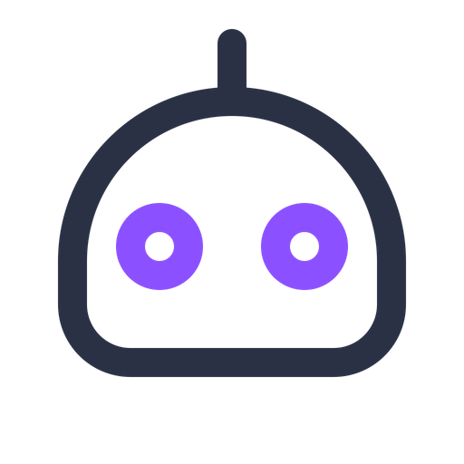

# Chatbots

  

  

# References

## Recurrent Neural Networks

In order to understand the concepts of **Seq2Seq** models or **Transformer** models, the first thing to know is about RNNs,

* [RNN Series](http://www.wildml.com/2015/09/recurrent-neural-networks-tutorial-part-1-introduction-to-rnns/)
* [Unfolding RNNs Part I](http://suriyadeepan.github.io/2017-01-07-unfolding-rnn/)
* [Unfolding RNNs Part II](http://suriyadeepan.github.io/2017-02-13-unfolding-rnn-2/ )
* [Understanding LSTMs](http://colah.github.io/posts/2015-08-Understanding-LSTMs/)
* [The Unreasonable Effectiveness of Recurrent Neural Networks](http://karpathy.github.io/2015/05/21/rnn-effectiveness/)
* [Recurrent neural network based language model](http://www.fit.vutbr.cz/research/groups/speech/publi/2010/mikolov_interspeech2010_IS100722.pdf)
* [Extensions of Recurrent Neural Network Language Model](http://www.fit.vutbr.cz/research/groups/speech/publi/2011/mikolov_icassp2011_5528.pdf)

## Sequence to Sequence Model

A *Sequence to Sequence Model* aims to map a fixed-length input with a fixed-length output where the length of the input and output may differ.

* [Sequence to Sequence Learning with Neural Networks](https://arxiv.org/pdf/1409.3215.pdf)
* [Learning Phrase Representations using RNN Encoder–Decoder for Statistical Machine Translation](https://arxiv.org/pdf/1406.1078.pdf)
* [Neural Machine Translation by jointly learning to Align and Translate](https://arxiv.org/pdf/1409.0473.pdf)
* [Chatbots with Seq2Seq Part 1](http://suriyadeepan.github.io/2016-06-28-easy-seq2seq/)
* [Practical seq2seq Part 2](http://suriyadeepan.github.io/2016-12-31-practical-seq2seq/)

  

## Transformer Model (Seq2Seq with Attention)

The Transformer in NLP is a novel architecture that aims to solve sequence-to-sequence tasks while handling long-range dependencies with ease.

*“The Transformer is the first transduction model relying entirely on self-attention to compute representations of its input and output without using sequence-aligned RNNs or convolution.”*

* [Attention in Neural Networks](https://buomsoo-kim.github.io/attention/2020/01/01/Attention-mechanism-1.md/)
* [Self Attention](https://towardsdatascience.com/illustrated-self-attention-2d627e33b20a)
* [Attention is all you Need](https://arxiv.org/pdf/1706.03762.pdf)
* [Illustrated Transformer](https://jalammar.github.io/illustrated-transformer/)
* [LSTM is dead. Long Live Transformers!](https://www.youtube.com/watch?v=S27pHKBEp30)
* [Transformer Neural Networks](https://www.youtube.com/playlist?list=PLTl9hO2Oobd_bzXUpzKMKA3liq2kj6LfE)

  

## Further Resources

* [Stanford Lectures | Natural Language Processing with Deep Learning](https://www.youtube.com/playlist?list=PL3FW7Lu3i5Jsnh1rnUwq_TcylNr7EkRe6)
* [Natural Language Processing Zero to Hero](https://www.youtube.com/watch?v=fNxaJsNG3-s&list=PLQY2H8rRoyvzDbLUZkbudP-MFQZwNmU4S)
