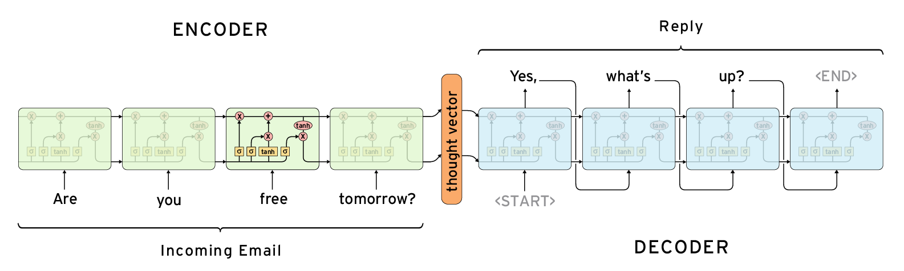
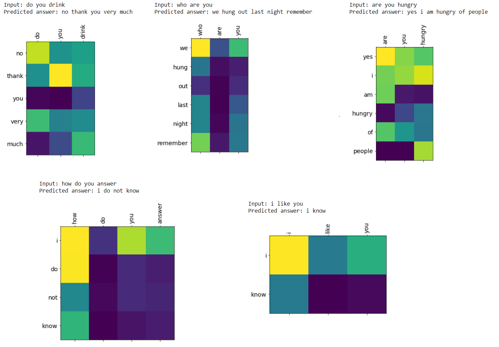

# Chatbot with Tensorflow and Keras
 
### Dataset:  

**Cornell Movie Dialogs Corpus** contains a large metadata-rich collection of fictional conversations extracted from raw movie scripts.
The corpus includes:
This corpus contains a large metadata-rich collection of fictional conversations extracted from raw movie scripts:

- **220,579** conversational exchanges between 10,292 pairs of movie characters
- Involves **9,035** characters from **617** movies
- In total **304,713** utterances
- Movie metadata included:
    - genres
    - release year
    - IMDB rating
    - number of IMDB votes
    - IMDB rating
- Character metadata included:
    - gender (for **3,774** characters)
    - position on movie credits (**3,321** characters)

A conversation example from the dataset:

```
Can we make this quick?  Roxanne Korrine and Andrew Barrett are having an incredibly horrendous public break- up on the quad.  Again.
Well, I thought we'd start with pronunciation, if that's okay with you.

Well, I thought we'd start with pronunciation, if that's okay with you.
Not the hacking and gagging and spitting part.  Please.

Not the hacking and gagging and spitting part.  Please.
Okay... then how 'bout we try out some French cuisine.  Saturday?  Night?

You're asking me out.  That's so cute. What's your name again?
Forget it.

No, no, it's my fault -- we didn't have a proper introduction ---
Cameron.
```

### Model:

This model uses [*Encoder-Decoder architecture*](https://machinelearningmastery.com/encoder-decoder-recurrent-neural-network-models-neural-machine-translation/). The encoder is a 1-layer Bi-directional GRU with 256 units and the decoder is a 2-layer Uni-directional GRU with 512 units. The [*Bahdanau Attention Mechanism*](https://medium.com/analytics-vidhya/neural-machine-translation-using-bahdanau-attention-mechanism-d496c9be30c3) was adopted as the **Attention model**.



### Results:

You can observe how the model decided to generate the output based on the input. For each pair of words from input and output the attention weight is visualized.



### Setup:

* Download the [*Cornell Movie Dialogs Corpus Dataset*](https://www.cs.cornell.edu/~cristian/Cornell_Movie-Dialogs_Corpus.html) (You will only need the **movie_lines.txt** and **movie_conversations.txt files**)
* Download the [*GloVe 50d Dataset*](https://www.kaggle.com/watts2/glove6b50dtxt)

### Helpful tutorials and articles:

**If you're new to this I suggest seeing these videos...**
* [Natural Language Processing | Tensorflow](https://www.youtube.com/watch?v=fNxaJsNG3-s&list=PLQY2H8rRoyvzDbLUZkbudP-MFQZwNmU4S)
* [Natural Language Processing with Deep Learning | Stanford University](https://www.youtube.com/playlist?list=PL3FW7Lu3i5Jsnh1rnUwq_TcylNr7EkRe6)

**After grasping the basic ideas, these articles will really help...**
* [Tips on training seq2seq type models](https://homes.cs.washington.edu/~msap/notes/seq2seq-tricks.html)
* [How to Configure an Encoder-Decoder Model for NMT](https://machinelearningmastery.com/configure-encoder-decoder-model-neural-machine-translation/)
* [Pytorch Chatbot Tutorial](https://pytorch.org/tutorials/beginner/chatbot_tutorial.html)
* [Neural machine translation with attention](https://www.tensorflow.org/tutorials/text/nmt_with_attention)
